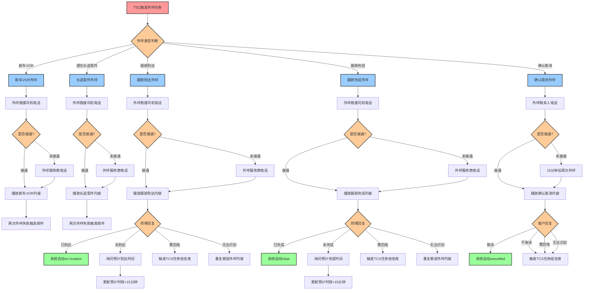

# Roadside Rescue Use Cases Diagram

## 外呼类型详细说明

### 1. 新车VOR (Vehicle Off Road)
- **触发条件**: 服务商已接单 + (里程≤1000Km 或 交付日期-今天≤30天)
- **外呼对象**: 救援司机电话 → 服务商电话(备用)
- **外呼内容**: 新车故障案件特殊提醒，要求现场操作标准专业
- **收益**: 20个/天，节省1小时通知时间

### 2. 潜在长途案件
- **触发条件**: 服务商已接单 + 服务距离≥80Km
- **外呼对象**: 救援司机电话 → 服务商电话(备用)
- **外呼内容**: 长途案件特殊提醒，禁止客人跟车，注意行车安全
- **收益**: 20个/天，节省1小时通知时间

### 3. 跟踪到达
- **触发条件**: TCS触发未按时到达跟进任务
- **外呼对象**: 救援司机电话 → 服务商电话(备用)
- **外呼内容**: 确认是否已到达现场
- **处理逻辑**: 
  - 已到达 → 系统自动on location
  - 未到达 → 询问预计到达时间，更新预计时效+15分钟
  - 需回电/无法识别 → 触发TCS任务给坐席
- **收益**: 180个/天，每个外呼2分钟，每日6小时

### 4. 跟踪完成
- **触发条件**: TCS触发未按时完成跟进任务
- **外呼对象**: 救援司机电话 → 服务商电话(备用)
- **外呼内容**: 确认是否已完成救援服务
- **处理逻辑**:
  - 已完成 → 系统自动clear
  - 未完成 → 询问预计完成时间，更新预计时效+15分钟
  - 需回电/无法识别 → 触发TCS任务给坐席
- **收益**: 120个/天，每个外呼2分钟，每日4小时

### 5. 确认取消
- **触发条件**: 服务商通过小程序取消此单回传到TCC
- **外呼对象**: 联系人电话(间隔15分钟重试)
- **外呼内容**: 确认是否取消救援
- **处理逻辑**:
  - 取消 → 系统自动cancelled
  - 不取消/需回电/无法识别 → 触发TCS任务给坐席
- **收益**: 120个/天，每个外呼2分钟，每日4小时

## 总体收益
- **总外呼量**: 460个/天
- **总节省时间**: 16小时/天
- **自动化率**: 通过智能外呼系统实现救援流程的自动化跟踪和管理
