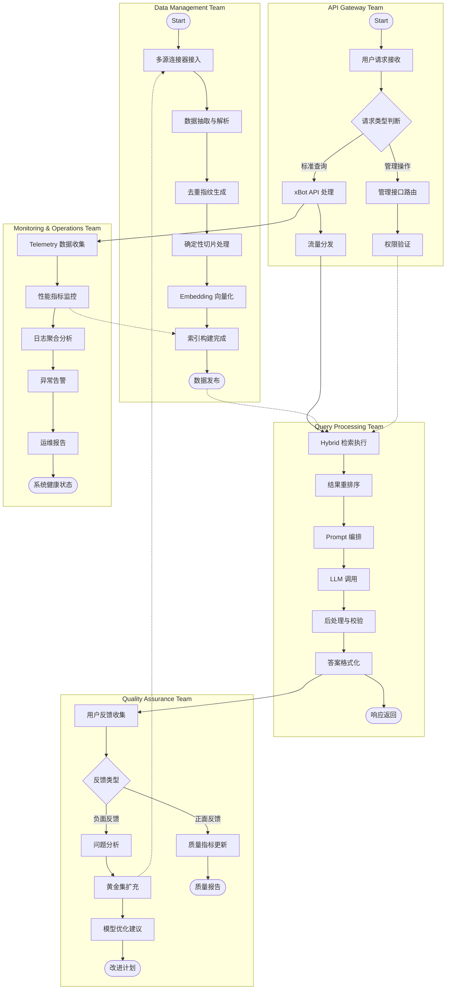
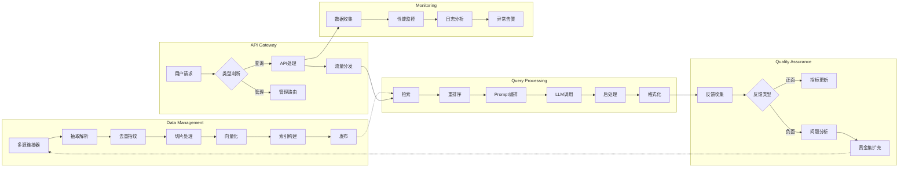
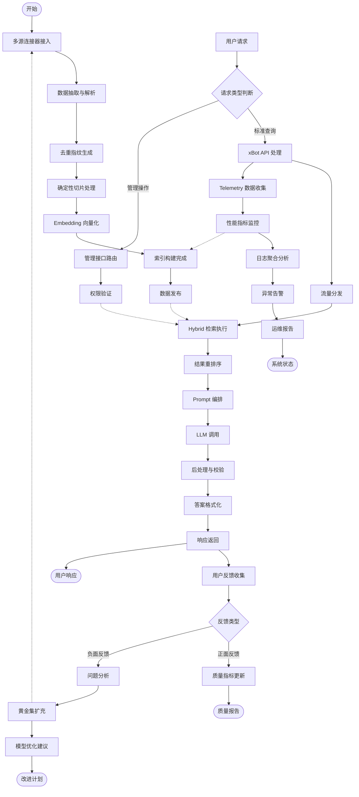

# xBot 2.0 System Workflow - Mermaid Code

## Refined Swimlane Workflow

```mermaid
flowchart TD
    subgraph DM["Data Management Team"]
        Start1([Start]) --> A1[多源连接器接入]
        A1 --> A2[数据抽取与解析]
        A2 --> A3[去重指纹生成]
        A3 --> A4[确定性切片处理]
        A4 --> A5[Embedding 向量化]
        A5 --> A6[索引构建完成]
        A6 --> End1([数据发布])
    end

    subgraph AG["API Gateway Team"]
        Start2([Start]) --> B1[用户请求接收]
        B1 --> B2{请求类型判断}
        B2 -->|标准查询| B3[xBot API 处理]
        B2 -->|管理操作| B4[管理接口路由]
        B3 --> B5[流量分发]
        B4 --> B6[权限验证]
    end

    subgraph QP["Query Processing Team"]
        B5 --> C1[Hybrid 检索执行]
        C1 --> C2[结果重排序]
        C2 --> C3[Prompt 编排]
        C3 --> C4[LLM 调用]
        C4 --> C5[后处理与校验]
        C5 --> C6[答案格式化]
        C6 --> End2([响应返回])
    end

    subgraph QA["Quality Assurance Team"]
        C6 --> D1[用户反馈收集]
        D1 --> D2{反馈类型}
        D2 -->|正面反馈| D3[质量指标更新]
        D2 -->|负面反馈| D4[问题分析]
        D4 --> D5[黄金集扩充]
        D5 --> D6[模型优化建议]
        D3 --> End3([质量报告])
        D6 --> End4([改进计划])
    end

    subgraph MO["Monitoring & Operations Team"]
        B3 --> E1[Telemetry 数据收集]
        E1 --> E2[性能指标监控]
        E2 --> E3[日志聚合分析]
        E3 --> E4[异常告警]
        E4 --> E5[运维报告]
        E5 --> End5([系统健康状态])
    end

    %% Cross-team dependencies
    End1 -.-> C1
    D5 -.-> A1
    E2 -.-> A6
    B6 -.-> C1
```

## Alternative Horizontal Swimlane Layout

```mermaid
flowchart LR
    subgraph DM["Data Management"]
        A1[多源连接器] --> A2[抽取解析]
        A2 --> A3[去重指纹]
        A3 --> A4[切片处理]
        A4 --> A5[向量化]
        A5 --> A6[索引构建]
        A6 --> A7[发布]
    end

    subgraph AG["API Gateway"]
        B1[用户请求] --> B2{类型判断}
        B2 -->|查询| B3[API处理]
        B2 -->|管理| B4[管理路由]
        B3 --> B5[流量分发]
    end

    subgraph QP["Query Processing"]
        C1[检索] --> C2[重排序]
        C2 --> C3[Prompt编排]
        C3 --> C4[LLM调用]
        C4 --> C5[后处理]
        C5 --> C6[格式化]
    end

    subgraph QA["Quality Assurance"]
        D1[反馈收集] --> D2{反馈类型}
        D2 -->|正面| D3[指标更新]
        D2 -->|负面| D4[问题分析]
        D4 --> D5[黄金集扩充]
    end

    subgraph MO["Monitoring"]
        E1[数据收集] --> E2[性能监控]
        E2 --> E3[日志分析]
        E3 --> E4[异常告警]
    end

    %% Flow connections
    A7 -.-> C1
    B5 --> C1
    C6 --> D1
    B3 --> E1
    D5 -.-> A1
```

## Detailed Process Flow with Decision Points

```mermaid
flowchart TD
    Start([开始]) --> A[多源连接器接入]
    A --> B[数据抽取与解析]
    B --> C[去重指纹生成]
    C --> D[确定性切片处理]
    D --> E[Embedding 向量化]
    E --> F[索引构建完成]
    F --> G[数据发布]
    
    H[用户请求] --> I{请求类型判断}
    I -->|标准查询| J[xBot API 处理]
    I -->|管理操作| K[管理接口路由]
    J --> L[流量分发]
    K --> M[权限验证]
    
    L --> N[Hybrid 检索执行]
    N --> O[结果重排序]
    O --> P[Prompt 编排]
    P --> Q[LLM 调用]
    Q --> R[后处理与校验]
    R --> S[答案格式化]
    S --> T[响应返回]
    
    T --> U[用户反馈收集]
    U --> V{反馈类型}
    V -->|正面反馈| W[质量指标更新]
    V -->|负面反馈| X[问题分析]
    X --> Y[黄金集扩充]
    Y --> Z[模型优化建议]
    
    J --> AA[Telemetry 数据收集]
    AA --> BB[性能指标监控]
    BB --> CC[日志聚合分析]
    CC --> DD[异常告警]
    DD --> EE[运维报告]
    
    %% Cross-process connections
    G -.-> N
    Y -.-> A
    BB -.-> F
    M -.-> N
    
    %% End points
    W --> End1([质量报告])
    Z --> End2([改进计划])
    T --> End3([用户响应])
    EE --> End4([系统状态])
```
