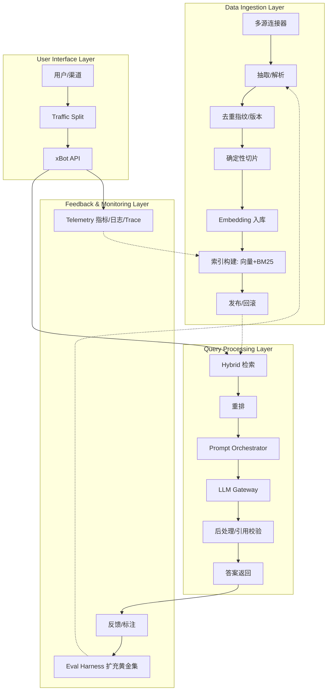
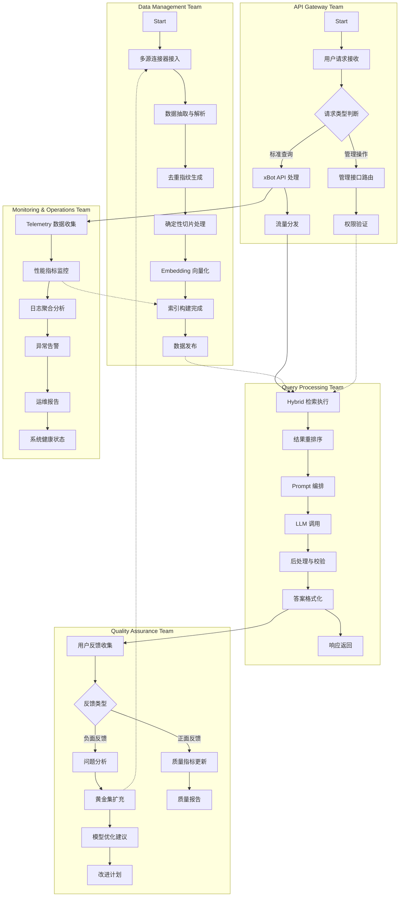

# xBot 2.0 System Workflow - Refined Swimlane Format

## System Architecture Workflow

## Refined Swimlane Workflow (Following Consulting Service Format)

## Key Process Flow Decisions

### Decision Points:
1. **请求类型判断** (B2): 标准查询 vs 管理操作
2. **反馈类型** (D2): 正面反馈 vs 负面反馈
3. **数据质量检查**: 是否需要重新处理数据
4. **性能阈值检查**: 是否需要扩容或优化

### External References:
- **HR Compensation & Classification** → **外部数据源认证**
- **Competitive Bidding Guidelines** → **模型选择策略**
- **Professional Service Agreement** → **服务级别协议**

### Process Steps with Sub-tasks:
- **数据抽取与解析**: 
  - 格式标准化
  - 内容验证
  - 元数据提取
- **Hybrid 检索执行**:
  - 向量检索
  - BM25 文本检索
  - 结果融合
- **Prompt 编排**:
  - 上下文组装
  - 指令优化
  - 参数配置

## Workflow Characteristics:
- **Swimlanes**: 按团队职责划分
- **Start/End Nodes**: 明确的流程起点和终点
- **Decision Points**: 关键业务判断节点
- **Cross-team Dependencies**: 虚线表示跨团队协作
- **External References**: 外部系统或策略引用
- **Sub-processes**: 复杂步骤的详细分解
